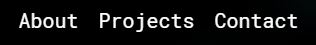
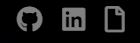
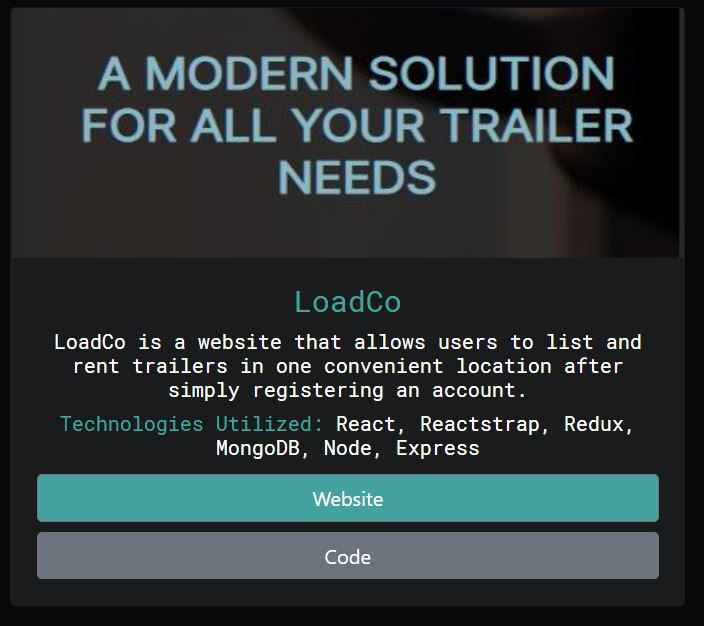
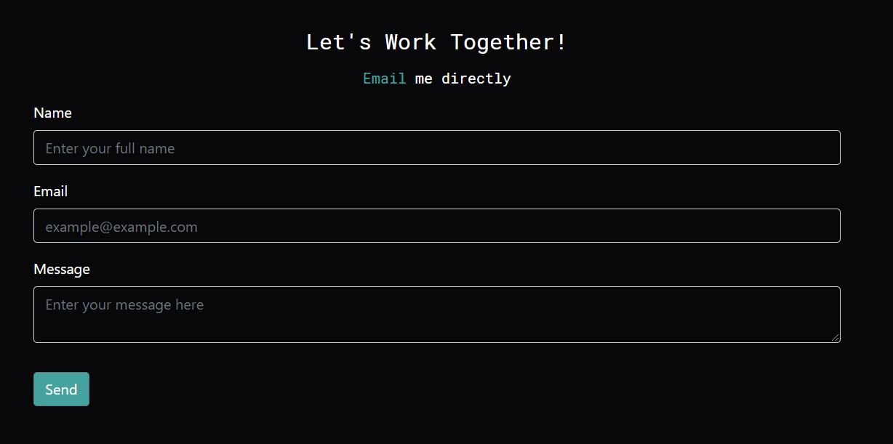

# CA-Portfolio

This site is my **Personal Portfolio**, being a centralized location to **Contact** me, view my **Projects**, and checkout my **Resume**.

Navigation is simple.

The below **Links** will scroll you directly to the selected section:

I've added some additional **Links** to the right. These open my **Github**, **LinkedIn**, and **Resume** respectively, in new windows.

# Projects

In the projects section, you will find cards that give a brief overview of what the app does, as well as the technologies utilized:

# Contact

Finally, the **Contact** section is an area specifically for getting in touch with me. Simply enter your name, email address, and your message, then select **Send**.
Or, you can select the highlighted **Email** link to email me directly.

